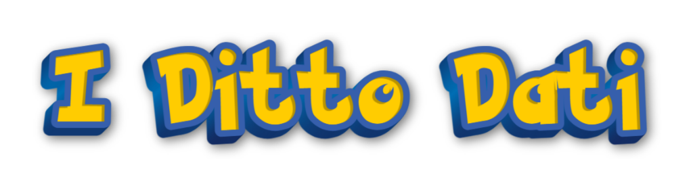

  

# 🚀 Project Overview  
The repository contains the solutions and the notebooks our team developed for the Kaggle Competition [FDS Pokémon Battles Prediction 2025] (https://www.kaggle.com/competitions/fds-pokemon-battles-prediction-2025). The goal is to predict who wins the Pokemon Battle (Gen 1), based on the dataset '.jsonl'. The dataset includes informations such as the first player's team details, the second player's lead details and the battle timeline.

## Team Members
gianlucapasquinelli03
marcores03
Gabriele-mp

## 🔧 Models
The repository contains the 3 best models we have built to solve the problem.

### 1. Model: 
### 2. Model: Ensemble with Logistic Regression and XGBoost  
It's an ensemble between Logistic Regression and XGBoost. Different models were tested for the final ensemble, e.g. Random Forest, Cat Boost, KNN, and different combination of these. Techniques such as Individual Performance, Prediction Correlation, Backward Elimination and Forward Selection were used to choose the best combination.
### 3. Model:

## 🛠️ Pipeline
Each model follows a rigorous data pipeline in order to maximize the performance.  
**1) Data Cleaning:** 4 samples have been removed due to the pokemons' level (not 100). The resulting dataset contains 9996 rows.  
**2) Feature Engineering:** Features designed specifically for that model.  
**3) Validation:** We used a local validation set with a 80/20 split.  
**4) Hyperparameter tuning:** Essential to prevent overfitting. Techniques such as GridSearchCV and RandomizedSearchCV from scikit-learn were used.

## 📦 Packages
The notebooks require the following packages:
- pandas  
- numpy  
- xgboost  
- scikit-learn  
- matplotlib
- tqdm
